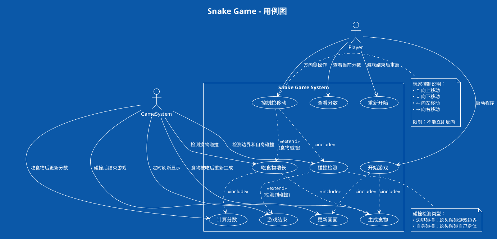
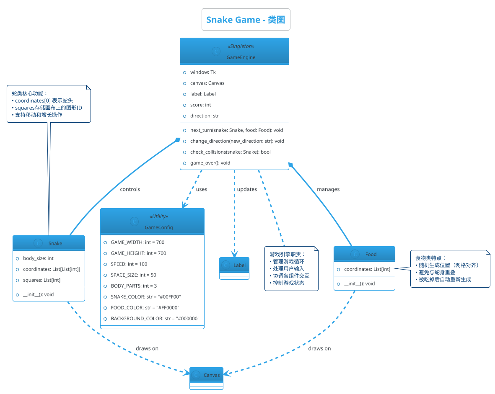
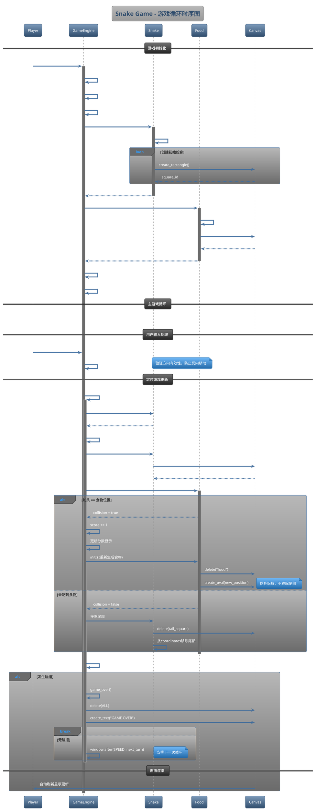
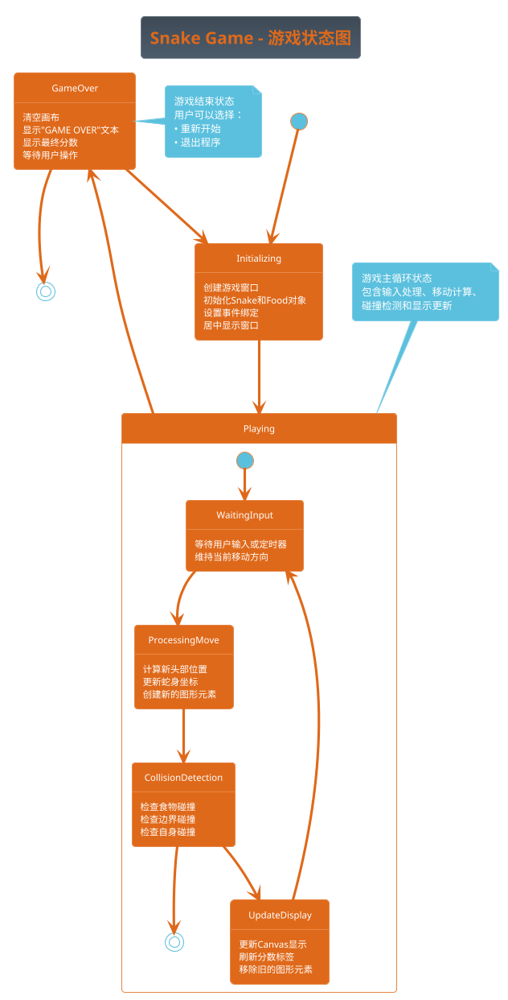
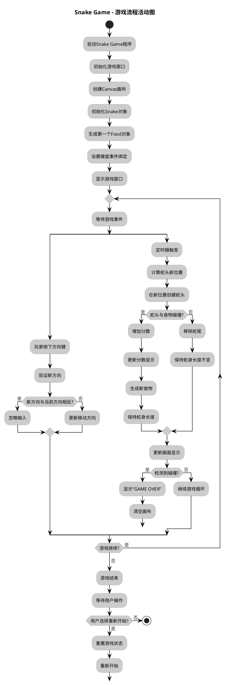

# Snake Game项目UML图表生成实践指导

## 1. 前置准备和目录结构

### 1.1 确认环境已搭建完成

运行环境验证脚本确保所有工具正常工作：

```cmd
cd C:\Users\86157\Desktop\SE\HW4\uml_tools
verify_environment.bat
```

### 1.2 创建完整的工作目录结构

在开始之前，我们需要创建一个清晰的目录结构来组织所有文件：

```cmd
cd C:\Users\86157\Desktop\SE\HW4

:: 创建主要目录
mkdir uml_diagrams
mkdir uml_diagrams\snake_game
mkdir uml_diagrams\generated_images
mkdir uml_diagrams\generated_images\png
mkdir uml_diagrams\generated_images\svg
mkdir uml_diagrams\pyreverse_output
mkdir uml_diagrams\templates
```

**最终目录结构应该如下：**

```
C:\Users\86157\Desktop\SE\HW4\
├── Snake Game\              # 现有的Snake Game源码目录
│   └── snake_game.py
├── uml_tools\              # CASE工具目录
│   ├── plantuml.jar
│   ├── verify_environment.bat
│   └── test.puml
├── uml_diagrams\           # UML图表工作目录（新建）
│   ├── snake_game\         # Snake Game的PlantUML源文件
│   ├── generated_images\   # 生成的图片文件
│   │   ├── png\           # PNG格式图片
│   │   └── svg\           # SVG格式图片
│   ├── pyreverse_output\   # Pyreverse生成的图片
│   ├── templates\          # PlantUML模板文件
│   └── diagram_index.html  # 图表索引页面
└── 批处理脚本文件...
```

### 1.3 验证目录创建

```cmd
:: 验证目录结构
tree C:\Users\86157\Desktop\SE\HW4 /F
```

## 2. Snake Game项目UML图表生成

### 2.1 分析Snake Game项目结构

首先分析现有的Snake Game代码文件：

```cmd
cd "C:\Users\86157\Desktop\SE\HW4\Snake Game"
type snake_game.py | more
```

通过代码分析，我们识别出以下核心组件：
- Snake类：管理蛇的状态和行为
- Food类：管理食物的生成和位置
- 游戏控制函数：next_turn, change_direction, check_collisions, game_over
- 全局变量和常量：游戏配置参数

### 2.2 使用Pyreverse自动生成类图

在Snake Game源码目录中执行：

```cmd
cd "C:\Users\86157\Desktop\SE\HW4\Snake Game"

:: 生成基础类图到指定输出目录
pyreverse -o png -p SnakeGame -d "..\uml_diagrams\pyreverse_output" snake_game.py

:: 生成详细类图（包含属性和方法）
pyreverse -o png -p SnakeGame_detailed -A -S -d "..\uml_diagrams\pyreverse_output" snake_game.py

:: 返回主目录
cd ..
```

### 2.3 创建Snake Game的PlantUML源文件

**重要：所有PlantUML源文件都要在 `uml_diagrams\snake_game\` 目录下创建**

#### 2.3.1 创建用例图文件

```cmd
cd C:\Users\86157\Desktop\SE\HW4\uml_diagrams\snake_game
```

使用记事本或VS Code创建文件 `snake_game_usecase.puml`：



#### 2.3.2 创建类图文件

在同一目录下创建文件 `snake_game_class.puml`：



#### 2.3.3 创建时序图文件

在同一目录下创建文件 `snake_game_sequence.puml`：



#### 2.3.4 创建状态图文件

在同一目录下创建文件 `snake_game_state.puml`：



#### 2.3.5 创建活动图文件

在同一目录下创建文件 `snake_game_activity.puml`：



### 2.4 验证Snake Game文件创建

```cmd
:: 检查Snake Game PlantUML文件是否创建成功
cd C:\Users\86157\Desktop\SE\HW4\uml_diagrams\snake_game
dir *.puml

:: 应该看到以下5个文件：
:: snake_game_usecase.puml
:: snake_game_class.puml
:: snake_game_sequence.puml
:: snake_game_state.puml
:: snake_game_activity.puml
```

## 3. 批量生成所有UML图表

### 3.1 创建批量生成脚本

**在主目录 `C:\Users\86157\Desktop\SE\HW4\` 下创建** 文件 `generate_snake_diagrams.bat`：

```cmd
cd C:\Users\86157\Desktop\SE\HW4
```

创建文件 `generate_snake_diagrams.bat`：

```bat
@echo off
echo ===== 批量生成Snake Game UML图表 =====
echo.

:: 设置路径变量
set PLANTUML_JAR=uml_tools\plantuml.jar
set SNAKE_DIR=uml_diagrams\snake_game
set OUTPUT_DIR=uml_diagrams\generated_images

:: 验证PlantUML JAR文件存在
if not exist %PLANTUML_JAR% (
    echo [错误] 找不到 %PLANTUML_JAR%
    echo 请确保PlantUML已正确下载到uml_tools目录
    pause
    exit /b 1
)

:: 创建输出目录
if not exist %OUTPUT_DIR% mkdir %OUTPUT_DIR%
if not exist %OUTPUT_DIR%\png mkdir %OUTPUT_DIR%\png
if not exist %OUTPUT_DIR%\svg mkdir %OUTPUT_DIR%\svg

echo 1. 生成Snake Game UML图表...
if exist %SNAKE_DIR%\*.puml (
    echo   生成PNG格式...
    java -Dfile.encoding=UTF-8 -jar %PLANTUML_JAR% -tpng -o ..\generated_images\png %SNAKE_DIR%\*.puml
    echo   生成SVG格式...
    java -Dfile.encoding=UTF-8 -jar %PLANTUML_JAR% -tsvg -o ..\generated_images\svg %SNAKE_DIR%\*.puml
    echo   Snake Game图表生成完成
) else (
    echo   [警告] 未找到Snake Game的PlantUML文件
)
echo.

echo 2. 生成项目类图（使用Pyreverse）...
echo   生成Snake Game类图...
if exist "Snake Game\snake_game.py" (
    cd "Snake Game"
    pyreverse -o png -p SnakeGame_Auto -d ..\uml_diagrams\pyreverse_output snake_game.py
    cd ..
    echo   Snake Game Pyreverse类图生成完成
) else (
    echo   [警告] 未找到Snake Game源文件
)
echo.

echo ===== 图表生成完成 =====
echo.
echo 图表文件位置：
echo - PNG格式: %OUTPUT_DIR%\png\
echo - SVG格式: %OUTPUT_DIR%\svg\
echo - Pyreverse: uml_diagrams\pyreverse_output\
echo.
echo 生成的图表包括：
echo.
echo Snake Game:
echo   - 用例图 (snake_game_usecase.png)
echo   - 类图 (snake_game_class.png)
echo   - 时序图 (snake_game_sequence.png)
echo   - 状态图 (snake_game_state.png)
echo   - 活动图 (snake_game_activity.png)
echo   - 自动生成类图 (classes_SnakeGame_Auto.png)
echo.

:: 检查生成结果
echo 3. 验证生成结果...
echo PNG图表文件:
dir %OUTPUT_DIR%\png\*.png
echo.
echo Pyreverse图表文件:
dir uml_diagrams\pyreverse_output\*.png
echo.

:: 自动打开输出目录
echo 正在打开图表目录...
explorer %OUTPUT_DIR%\png

pause
```

### 3.2 执行批量生成

```cmd
cd C:\Users\86157\Desktop\SE\HW4
generate_snake_diagrams.bat
```

## 4. 创建图表索引和查看页面

### 4.1 创建HTML索引页面

**在 `uml_diagrams\` 目录下创建** 文件 `diagram_index.html`：

```cmd
cd C:\Users\86157\Desktop\SE\HW4\uml_diagrams
```

创建文件 `diagram_index.html`：

```html
<!DOCTYPE html>
<html lang="zh-CN">
<head>
    <meta charset="UTF-8">
    <meta name="viewport" content="width=device-width, initial-scale=1.0">
    <title>UML图表索引 - Snake Game项目</title>
    <style>
        body { 
            font-family: 'Microsoft YaHei', sans-serif; 
            margin: 20px; 
            background-color: #f5f5f5;
        }
        h1 { 
            color: #2c3e50; 
            text-align: center;
            border-bottom: 3px solid #3498db;
            padding-bottom: 10px;
        }
        h2 { 
            color: #2c3e50; 
            background-color: #ecf0f1;
            padding: 10px;
            border-left: 5px solid #3498db;
        }
        h3 { 
            color: #34495e; 
            margin-top: 20px;
        }
        .project { 
            border: 1px solid #ddd; 
            margin: 20px 0; 
            padding: 15px; 
            border-radius: 5px; 
            background-color: white;
            box-shadow: 0 2px 5px rgba(0,0,0,0.1);
        }
        .diagram { 
            margin: 10px 0; 
            border: 1px solid #eee;
            padding: 10px;
            border-radius: 3px;
        }
        img { 
            max-width: 100%; 
            border: 1px solid #ccc; 
            margin: 5px 0; 
            cursor: pointer;
            transition: transform 0.2s;
        }
        img:hover {
            transform: scale(1.02);
            box-shadow: 0 4px 8px rgba(0,0,0,0.2);
        }
        .diagram-grid { 
            display: grid; 
            grid-template-columns: repeat(auto-fit, minmax(400px, 1fr)); 
            gap: 20px; 
        }
        .file-info {
            background-color: #f8f9fa;
            padding: 10px;
            border-radius: 3px;
            margin: 10px 0;
            font-family: monospace;
            font-size: 0.9em;
        }
        .nav {
            background-color: #34495e;
            padding: 10px;
            margin-bottom: 20px;
        }
        .nav a {
            color: white;
            text-decoration: none;
            margin-right: 20px;
            padding: 5px 10px;
            border-radius: 3px;
        }
        .nav a:hover {
            background-color: #2c3e50;
        }
    </style>
</head>
<body>
    <div class="nav">
        <a href="#snake-game">Snake Game</a>
        <a href="#instructions">使用说明</a>
        <a href="#files">文件结构</a>
    </div>

    <h1>Snake Game项目UML图表集</h1>
    
    <div id="snake-game" class="project">
        <h2>🐍 Snake Game项目</h2>
        <div class="diagram-grid">
            <div class="diagram">
                <h3>用例图 (Use Case Diagram)</h3>
                <div class="file-info">文件: generated_images/png/snake_game_usecase.png</div>
                
                <p><strong>说明：</strong>展示玩家与游戏系统的交互关系，包括游戏控制、碰撞检测等核心功能。</p>
            </div>
            
            <div class="diagram">
                <h3>类图 (Class Diagram) - PlantUML</h3>
                <div class="file-info">文件: generated_images/png/snake_game_class.png</div>
                
                <p><strong>说明：</strong>展示Snake、Food、GameEngine等核心类的结构和关系。</p>
            </div>
            
            <div class="diagram">
                <h3>类图 (Class Diagram) - Pyreverse自动生成</h3>
                <div class="file-info">文件: pyreverse_output/classes_SnakeGame_Auto.png</div>
                
                <p><strong>说明：</strong>由Pyreverse工具从源代码自动生成的类图，展示真实的代码结构。</p>
            </div>
            
            <div class="diagram">
                <h3>时序图 (Sequence Diagram)</h3>
                <div class="file-info">文件: generated_images/png/snake_game_sequence.png</div>
                
                <p><strong>说明：</strong>展示游戏循环中各对象间的交互时序，从初始化到游戏结束的完整流程。</p>
            </div>
            
            <div class="diagram">
                <h3>状态图 (State Diagram)</h3>
                <div class="file-info">文件: generated_images/png/snake_game_state.png</div>
                
                <p><strong>说明：</strong>展示游戏从开始到结束的状态转换过程。</p>
            </div>
            
            <div class="diagram">
                <h3>活动图 (Activity Diagram)</h3>
                <div class="file-info">文件: generated_images/png/snake_game_activity.png</div>
                
                <p><strong>说明：</strong>展示游戏的完整流程和用户操作路径。</p>
            </div>
        </div>
    </div>
    
    <div id="instructions" class="project">
        <h2>📖 使用说明</h2>
        <div style="display: grid; grid-template-columns: 1fr 1fr; gap: 20px;">
            <div>
                <h3>UML图表类型说明</h3>
                <ul>
                    <li><strong>用例图</strong>：展示系统功能和用户交互关系</li>
                    <li><strong>类图</strong>：显示系统中类的结构和关系</li>
                    <li><strong>时序图</strong>：描述对象间的交互时序</li>
                    <li><strong>状态图</strong>：展示对象状态转换</li>
                    <li><strong>活动图</strong>：描述业务流程和算法逻辑</li>
                </ul>
            </div>
            
            <div>
                <h3>文件格式说明</h3>
                <ul>
                    <li><strong>PNG格式</strong>：适合文档嵌入和打印，文件较小</li>
                    <li><strong>SVG格式</strong>：矢量图形，适合网页显示和无损缩放</li>
                    <li><strong>PlantUML源文件(.puml)</strong>：可编辑的UML源代码</li>
                    <li><strong>Pyreverse生成</strong>：从源代码自动生成的类图</li>
                </ul>
            </div>
        </div>
        
        <h3>查看方式</h3>
        <ul>
            <li>点击图片可在新窗口中打开大图</li>
            <li>PNG文件可直接用图片查看器打开</li>
            <li>SVG文件用浏览器打开效果最佳</li>
            <li>源文件(.puml)可用VS Code + PlantUML扩展编辑</li>
        </ul>
    </div>
    
    <div id="files" class="project">
        <h2>📁 文件结构</h2>
        <div class="file-info">
📦 C:\Users\86157\Desktop\SE\HW4\
├── 📁 Snake Game\                    # Snake Game源码
│   └── 🐍 snake_game.py
├── 📁 uml_tools\                     # CASE工具
│   ├── ☕ plantuml.jar
│   └── ⚙️ verify_environment.bat
├── 📁 uml_diagrams\                  # UML图表工作区
│   ├── 📁 snake_game\               # Snake Game PlantUML源文件
│   │   ├── 📄 snake_game_usecase.puml
│   │   ├── 📄 snake_game_class.puml
│   │   ├── 📄 snake_game_sequence.puml
│   │   ├── 📄 snake_game_state.puml
│   │   └── 📄 snake_game_activity.puml
│   ├── 📁 generated_images\          # 生成的图片文件
│   │   ├── 📁 png\                  # PNG格式图片
│   │   └── 📁 svg\                  # SVG格式图片
│   ├── 📁 pyreverse_output\         # Pyreverse生成的图片
│   └── 🌐 diagram_index.html        # 本索引页面
└── ⚙️ generate_snake_diagrams.bat    # 批量生成脚本
        </div>
    </div>

    <footer style="text-align: center; margin-top: 40px; padding: 20px; background-color: #ecf0f1;">
        <p>生成时间: <script>document.write(new Date().toLocaleString('zh-CN'));</script></p>
        <p>使用工具: PlantUML + Pyreverse + Python + Java</p>
        <p>项目: Snake Game UML建模实践</p>
    </footer>
</body>
</html>
```

### 4.2 打开图表索引页面

```cmd
cd C:\Users\86157\Desktop\SE\HW4\uml_diagrams
start diagram_index.html
```

## 5. 验证所有文件和目录

### 5.1 最终目录结构检查

```cmd
cd C:\Users\86157\Desktop\SE\HW4
tree /F
```

应该看到完整的目录结构：

```
C:\Users\86157\Desktop\SE\HW4\
├── Snake Game\
│   └── snake_game.py
├── uml_tools\
│   ├── plantuml.jar
│   ├── verify_environment.bat
│   └── test.puml
├── uml_diagrams\
│   ├── snake_game\
│   │   ├── snake_game_usecase.puml
│   │   ├── snake_game_class.puml
│   │   ├── snake_game_sequence.puml
│   │   ├── snake_game_state.puml
│   │   └── snake_game_activity.puml
│   ├── generated_images\
│   │   ├── png\
│   │   └── svg\
│   ├── pyreverse_output\
│   └── diagram_index.html
└── generate_snake_diagrams.bat
```

### 5.2 文件创建检查清单

**检查所有必需文件是否已创建：**

- [ ] `uml_diagrams\snake_game\snake_game_usecase.puml`
- [ ] `uml_diagrams\snake_game\snake_game_class.puml`
- [ ] `uml_diagrams\snake_game\snake_game_sequence.puml`
- [ ] `uml_diagrams\snake_game\snake_game_state.puml`
- [ ] `uml_diagrams\snake_game\snake_game_activity.puml`
- [ ] `uml_diagrams\diagram_index.html`
- [ ] `generate_snake_diagrams.bat`

### 5.3 一键检查脚本

**在主目录创建** `check_files.bat`：

```cmd
cd C:\Users\86157\Desktop\SE\HW4
```

创建文件 `check_files.bat`：

```bat
@echo off
echo ===== 检查Snake Game UML项目文件完整性 =====
echo.

set error_count=0

echo 1. 检查PlantUML源文件...
if exist "uml_diagrams\snake_game\snake_game_usecase.puml" (echo ✓ Snake Game用例图) else (echo ✗ Snake Game用例图 & set /a error_count+=1)
if exist "uml_diagrams\snake_game\snake_game_class.puml" (echo ✓ Snake Game类图) else (echo ✗ Snake Game类图 & set /a error_count+=1)
if exist "uml_diagrams\snake_game\snake_game_sequence.puml" (echo ✓ Snake Game时序图) else (echo ✗ Snake Game时序图 & set /a error_count+=1)
if exist "uml_diagrams\snake_game\snake_game_state.puml" (echo ✓ Snake Game状态图) else (echo ✗ Snake Game状态图 & set /a error_count+=1)
if exist "uml_diagrams\snake_game\snake_game_activity.puml" (echo ✓ Snake Game活动图) else (echo ✗ Snake Game活动图 & set /a error_count+=1)

echo.
echo 2. 检查脚本和索引文件...
if exist "generate_snake_diagrams.bat" (echo ✓ 批量生成脚本) else (echo ✗ 批量生成脚本 & set /a error_count+=1)
if exist "uml_diagrams\diagram_index.html" (echo ✓ 图表索引页面) else (echo ✗ 图表索引页面 & set /a error_count+=1)

echo.
echo 3. 检查目录结构...
if exist "uml_diagrams\generated_images\png" (echo ✓ PNG输出目录) else (echo ✗ PNG输出目录 & set /a error_count+=1)
if exist "uml_diagrams\generated_images\svg" (echo ✓ SVG输出目录) else (echo ✗ SVG输出目录 & set /a error_count+=1)
if exist "uml_diagrams\pyreverse_output" (echo ✓ Pyreverse输出目录) else (echo ✗ Pyreverse输出目录 & set /a error_count+=1)

echo.
if %error_count%==0 (
    echo ===== 🎉 所有文件检查通过！ =====
    echo 可以运行 generate_snake_diagrams.bat 生成图表
) else (
    echo ===== ❌ 发现 %error_count% 个问题 =====
    echo 请检查上述缺失的文件和目录
)

pause
```

运行检查：

```cmd
check_files.bat
```

## 6. 快速生成命令参考

### 6.1 单独生成特定图表

```cmd
:: 进入工作目录
cd C:\Users\86157\Desktop\SE\HW4

:: 生成单个PlantUML图表
java -jar uml_tools\plantuml.jar uml_diagrams\snake_game\snake_game_usecase.puml

:: 生成所有Snake Game图表
java -jar uml_tools\plantuml.jar uml_diagrams\snake_game\*.puml

:: 使用Pyreverse生成类图
cd "Snake Game"
pyreverse -o png -p SnakeGame snake_game.py
cd ..
```

### 6.2 常用格式转换

```cmd
:: 生成PNG格式
java -jar uml_tools\plantuml.jar -tpng uml_diagrams\snake_game\*.puml

:: 生成SVG格式
java -jar uml_tools\plantuml.jar -tsvg uml_diagrams\snake_game\*.puml

:: 生成PDF格式
java -jar uml_tools\plantuml.jar -tpdf uml_diagrams\snake_game\*.puml
```

## 7. 总结

通过本指导文档，您现在已经：

1. **创建了完整的Snake Game UML图表集**：
   - 用例图：展示游戏功能和用户交互
   - 类图：展示代码结构和类关系
   - 时序图：展示游戏循环的交互过程
   - 状态图：展示游戏状态转换
   - 活动图：展示游戏流程

2. **掌握了CASE工具的使用**：
   - PlantUML手工建模
   - Pyreverse自动分析
   - 批处理脚本自动化

3. **建立了规范的项目结构**：
   - 源文件分类存放
   - 生成文件统一管理
   - 便于维护和扩展

现在您可以使用这些UML图表来：
- 理解Snake Game的设计架构
- 为代码重构提供参考
- 创建项目文档
- 向他人展示项目结构

恭喜您完成了Snake Game项目的完整UML建模实践！
